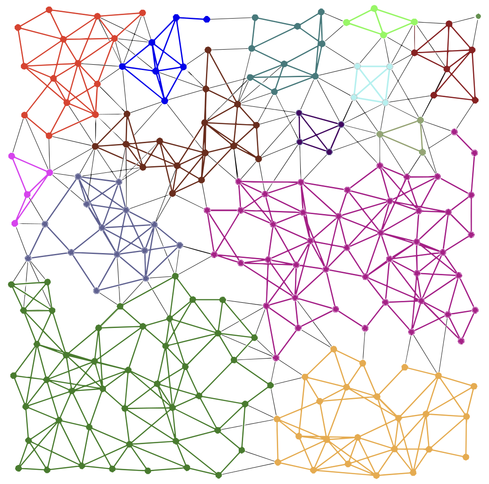

# Source code for *Efficient Routing on Quantum Networks using Adaptive Clustering*

This repo contains the source code for QuARC (Quantum Adaptive Routing Using Clusters), the cluster-based quantum routing protocol introduced in the paper 
*Efficient Routing on Quantum Networks using Adaptive Clustering* which appeared in [ICNP 2024](https://icnp24.cs.ucr.edu).

You can find our paper [here](https://arxiv.org/pdf/2410.23007).

## Running QuARC

To run QuARC, first install Python >= 3.10. This step is platform specific.

Next, clone and enter the repo

    git clone https://github.com/cbclayton/clustered-quantum-routing.git
    cd clustered-quantum-routing

To set up a virtual environment for QuARC, run

    python -m venv .

and activate the virtual environment. In bash/zsh the command to activate is `source bin/activate` (see [here](https://docs.python.org/3/library/venv.html#how-venvs-work) for other platforms).
Finally, install the requirements

    python -m pip install -r requirements.txt

## Reproduce results from the paper

To reproduce the results from the paper (Figures 5, 6, and 7), run

    python -m recreate_figs

Generating all the data for QuARC may take up to one day.
Partial results, including using fewer independent trials, can be easily obtained by modifying the script `recreate_figs.py`.
Plots are saved to the `figures` directory as they are created.

## Visualizing QuARC

As the QuARC simulator runs, it saves visualizations of the cluster configurations to the `graphs` directory. Viewing these files gives an easy way to visualize the effects of QuARC's cluster reconfiguration scheme.

## Contact

Please contact Connor Clayton (cbclayto@cs.umd.edu) with any questions.
